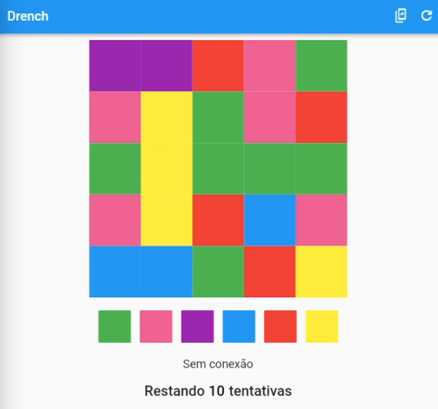
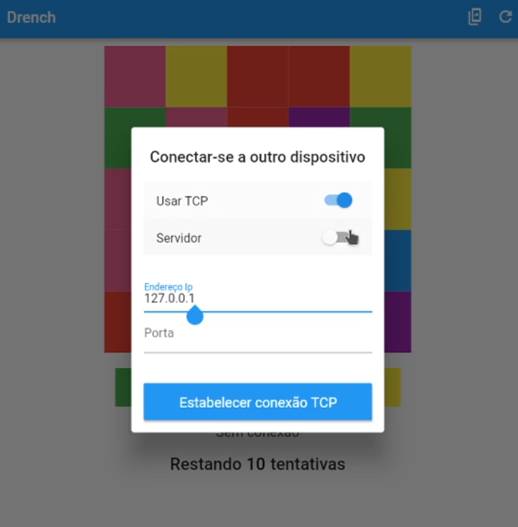
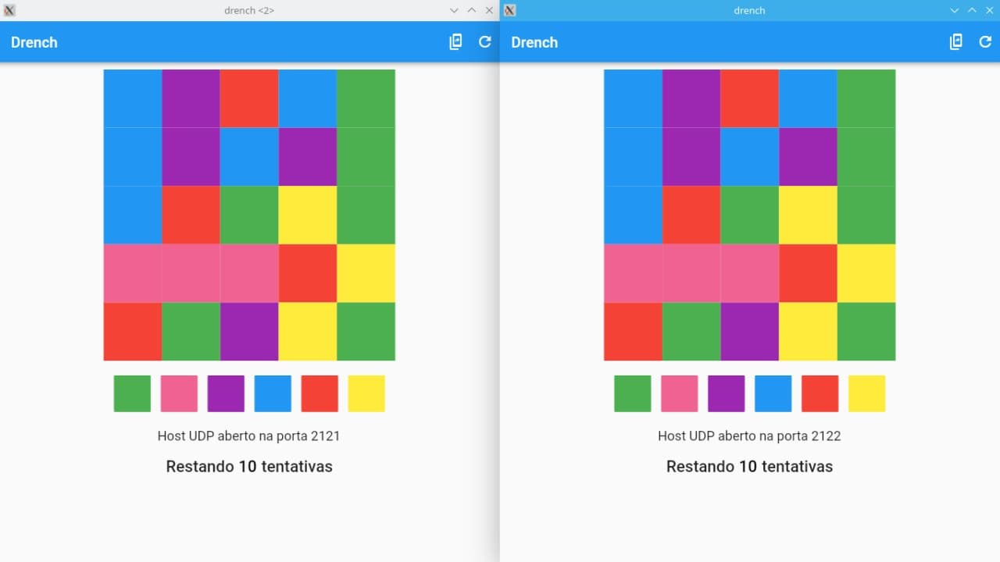

# Drench

Implementação do jogo Drench, como parte de um trabalho prático da disciplina de sistemas distribuídos

## Comunicação via sockets

A proposta do trabalho é implementar uma comunicação entre dois dispositivos via Sockets sobre os protocolos TCP e UDP.

Para implementação em flutter, as seguintes referências foram utilizadas:

- TCP: https://jamesslocum.com/blog/post/67566023889
- UDP: https://jamesslocum.com/blog/post/77759061182

## Comunicação via gRPC

O trabalho será reimplementar a comunicação feita anteriormente com sockets, agora utilizando invocação remota.

Referências utilizadas:

- gRPC: https://grpc.io/
- gRPC Dart: https://grpc.io/docs/languages/dart/
- protocolBuffers: https://developers.google.com/protocol-buffers

## Demonstração

### Imagens

<table>
    <td>
        
    </td>
    <td>
        
    </td>
</table>

### Video

Vídeo com demonstração do jogo em funcionamento multiplayer: https://www.youtube.com/watch?v=d5h8v_d_-H8

## Autores

[Leonam Teixeira de Vasconcelos](https://github.com/leonamtv)

[André Marcelino de Souza Neves](https://github.com/AndreNeves97)
